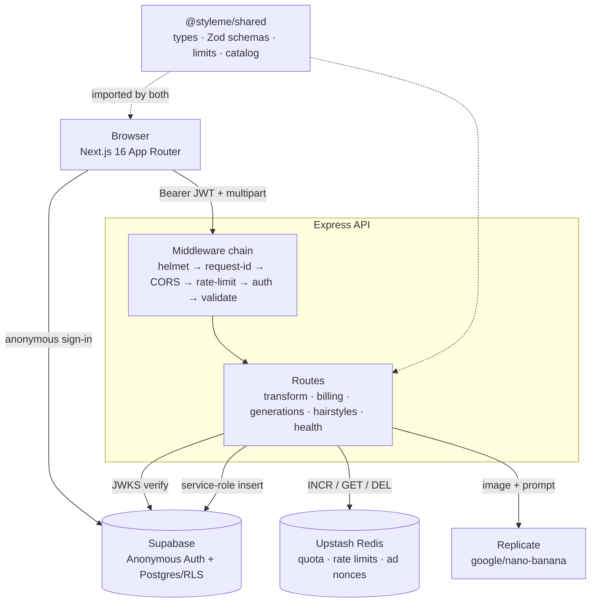

# StyleMe

AI hairstyle try-on — a TypeScript monorepo with server-authoritative quotas, asymmetric JWT verification, and a fraud-resistant rewarded-ad flow built without server-side ad verification.

A user uploads a selfie, picks a hairstyle (from a 40-item catalog, a free-text description, or a reference photo), and receives a photorealistic transformation generated by Replicate. Each generation costs real money, which is what makes the interesting parts of this codebase interesting: quota enforcement, rate limiting, abuse resistance, and an audit trail all have to be correct on the server, because the client cannot be trusted with any of them.

The project is a full rewrite of an earlier version whose monetization lived in `localStorage` — bypassable by opening DevTools. Everything billing-adjacent now lives behind Supabase-authenticated, Redis-backed, server-side enforcement.

**Status:** feature-complete, pre-production. Deployment configuration exists for Vercel and Railway; the application is not deployed publicly yet. There are no users and no production metrics, and this README does not claim any.

---

## Key Features

- **Three transform modes** — preset catalog (40 styles), free-text prompt (10–200 chars, validated by a Zod schema shared between client and server), or a reference photo.
- **Server-side quota** — 3 free generations per UTC day plus rewarded credits, held in Redis and keyed by Supabase user ID. Not bypassable from the client.
- **Rewarded-ad credits without SSV** — server-issued, user-bound nonce with a minimum watch timer, daily cap, and atomic single-use burn. Web rewarded ads have no server-side verification callback, so the protection is architectural (ADR-009).
- **Generation history** — cursor (keyset) pagination, soft delete with rollback-capable optimistic UI, and a regenerate flow that replays the original mode and parameters.
- **Anonymous authentication** — Supabase anonymous sessions; no signup required to use the app.
- **Four locales** — English, German, Ukrainian, Russian, with locale-prefixed routing and 188 message keys per locale.
- **Light / dark / system theming** — SSR-safe, no flash of unstyled content.

---

## Tech Stack

| Layer | Technology | Purpose |
| --- | --- | --- |
| Monorepo | npm workspaces | Three packages, one lockfile, no build orchestrator (ADR-002) |
| Frontend | Next.js 16.2.9 (App Router, Turbopack), React 19.2 | Locale-segmented routing, RSC layout, client feature modules |
| Server state | TanStack Query 5 | Caching, mutations, optimistic updates |
| Client state | Zustand 5 | Screen routing, current image, selected mode |
| Forms | React Hook Form + Zod | Client validation against the same schema the server enforces |
| Styling | CSS Modules + CSS custom properties, `next-themes` | Design tokens, light/dark/system |
| i18n | `next-intl` 4 | 4 locales, `localePrefix: 'as-needed'` |
| Backend | Express 4 + TypeScript 5 (strict) | REST API on port 3001 |
| Auth | Supabase anonymous auth, `jose` | ES256 via JWKS, HS256 fallback for legacy projects |
| Database | Supabase Postgres + Row Level Security | `generations` audit table |
| Cache / limits | Upstash Redis (REST) | Rate limiting, daily quota, ad-session nonces |
| AI | Replicate — `google/nano-banana` | Image-to-image hairstyle transformation |
| Image processing | `sharp` (server), Canvas API (client) | Normalization server-side, EXIF-aware downscale client-side |
| Validation | Zod 3 | Shared schemas, request bodies, environment |
| Logging | `pino` + `pino-http` | Structured logs, request IDs, secret redaction |
| Testing | Vitest, Playwright | Unit, dual-backend contract, E2E |
| CI | GitHub Actions | Typecheck → build → unit tests, plus a separate E2E job |
| Infrastructure | Vercel (web), Railway (API) | Configured, not yet deployed |

Deliberately **not** used: Turborepo (three packages don't justify it), Prisma (Supabase client is the access path), Tailwind (CSS Modules + tokens), Docker (platform builders handle it).

---

## Architecture

Two deployable applications and one shared package. The web app never talks to Replicate, and never holds a service-role key. Every privileged operation — quota decrement, generation insert, credit grant — happens in the API.



### Request flow — a single generation

1. The browser resizes the selected image to a maximum edge of 1024 px on a Canvas (EXIF-aware), cutting upload size by roughly an order of magnitude.
2. It POSTs `multipart/form-data` with a Supabase-issued Bearer JWT.
3. The API verifies the JWT against the project's JWKS endpoint (ES256), falling back to HS256 for legacy projects.
4. Per-IP and per-user rate limits are checked in Redis.
5. Quota is checked: free daily allowance first, then rewarded credits.
6. The request body is validated with a Zod schema imported from `@styleme/shared` — the same object the client validated against.
7. `sharp` normalizes the image; the server-only prompt for the chosen preset is resolved through a subpath export the client bundle cannot reach.
8. Replicate is called, with retry on 429 (Replicate throttles accounts below a balance threshold).
9. The result is written to the `generations` table with the service-role key, and a fresh balance snapshot is returned alongside the result so the client never needs a second round trip.

### Why the shared package exists

`@styleme/shared` is the single source of truth for API types, Zod schemas, error codes, numeric limits, and the hairstyle catalog. Client-server validation drift is impossible by construction: both sides import the same schema object.

Hairstyle prompts are the one thing the client must never see. They live in `@styleme/shared/hairstyles/prompts`, exposed only through a subpath export and imported only from API code. The root export deliberately does not re-export them.

---

## Project Structure

```text
styleme/
├── apps/
│   ├── api/                       # Express + TypeScript (CommonJS)
│   │   ├── src/
│   │   │   ├── env.ts             # Zod-validated env, fail-fast at import
│   │   │   ├── server.ts          # composition root
│   │   │   ├── middleware/        # auth · rate-limit · validate · error-handler · request-id
│   │   │   ├── routes/            # transform · billing · generations · hairstyles · health
│   │   │   ├── lib/               # redis · quota · rate-limit · ad-session · cursor · replicate-*
│   │   │   └── db/generations.ts  # service-role writes
│   │   └── tests/                 # Vitest unit + dual-backend contract tests
│   │
│   └── web/                       # Next.js 16 App Router
│       ├── src/
│       │   ├── app/[locale]/      # locale-segmented layout + page
│       │   ├── features/          # upload · catalog · processing · result · history · rewards · theme
│       │   ├── lib/               # api-client · auth-provider · app-store · image-resize · env
│       │   ├── i18n/              # next-intl routing + request config
│       │   ├── messages/          # en · de · uk · ru (188 keys each)
│       │   └── proxy.ts           # next-intl locale negotiation
│       └── e2e/                   # Playwright specs
│
├── packages/shared/               # @styleme/shared — types, schemas, limits, catalog, prompts
├── supabase/migrations/           # SQL migrations (idempotent)
├── docs/adr/                      # 12 architecture decision records
└── .github/workflows/ci.yml
```

Each web feature owns its components, hooks, and CSS Modules. Cross-feature communication goes through the Zustand store or the API client — never through direct imports of another feature's internals.

---

## Getting Started

### Prerequisites

- Node.js 20 (see `.nvmrc`), npm 9+
- A Supabase project — anonymous sign-ins enabled
- An Upstash Redis database — optional in development
- A Replicate API token

Supabase and Upstash credentials can be omitted in development: the API falls back to a deterministic dev user and an in-memory Redis. Production refuses to start without them.

### Installation

```bash
git clone git@github.com:IvanSytnik/styleme-second_v.git
cd styleme-second_v
npm install

cp apps/api/.env.example apps/api/.env
cp apps/web/.env.example apps/web/.env.local
```

Fill in the two `.env` files (see below), then build the shared package — the API resolves it from `dist/`, so this must happen before anything else runs:

```bash
npm run build:shared
```

### Database setup

Apply both migrations to your Supabase project, in filename order, via the SQL editor or the Supabase CLI:

```text
supabase/migrations/20260628000000_initial.sql
supabase/migrations/20260702000000_history_and_soft_delete.sql
```

They create the `generations` table, its RLS policies, and a partial index over non-deleted rows. Both are idempotent and safe to re-run.

### Development

Two terminals:

```bash
npm run dev:api    # http://localhost:3001
npm run dev:web    # http://localhost:3000
```

Any change inside `packages/shared` requires `npm run build:shared` and an API restart.

---

## Environment Variables

### API (`apps/api/.env`)

| Variable | Required | Description |
| --- | ---: | --- |
| `REPLICATE_API_TOKEN` | Yes | Replicate API token |
| `PORT` | No | API port. Defaults to `3001` |
| `NODE_ENV` | No | `development` \| `production` \| `test` |
| `FRONTEND_URL` | Prod | The single allowed CORS origin. Defaults to `http://localhost:3000`; required explicitly in production |
| `LOG_LEVEL` | No | pino level. Defaults to `info` |
| `SUPABASE_URL` | Prod | Project URL, base only — no path, no trailing slash |
| `SUPABASE_ANON_KEY` | Prod | Public anon key |
| `SUPABASE_SERVICE_ROLE_KEY` | Prod | Service-role key. API only — never exposed to the client |
| `SUPABASE_JWT_SECRET` | No | Legacy HS256 secret. Unused by projects signing with ES256/JWKS |
| `UPSTASH_REDIS_REST_URL` | Prod | Upstash REST endpoint |
| `UPSTASH_REDIS_REST_TOKEN` | Prod | Upstash REST token |
| `REPLICATE_MOCK` | No | `1` returns a canned image instead of calling Replicate. E2E only — the process refuses to start in production with this set |

"Prod" means the process exits at boot if the variable is absent when `NODE_ENV=production`.

### Web (`apps/web/.env.local`)

| Variable | Required | Description |
| --- | ---: | --- |
| `NEXT_PUBLIC_API_URL` | No | API base URL. Defaults to `http://localhost:3001` |
| `NEXT_PUBLIC_SUPABASE_URL` | Yes | Supabase project URL |
| `NEXT_PUBLIC_SUPABASE_ANON_KEY` | Yes | Public anon key |
| `NEXT_PUBLIC_AD_PROVIDER` | No | `dev` (built-in 15 s modal) \| `gpt` (Google Publisher Tag, skeleton) \| `off`. Defaults to `dev`; must be `off` in production until a real ad provider is wired |

`.env.e2e.example` documents the additional variables Playwright needs.

---

## Available Scripts

Run from the repository root:

| Command | Description |
| --- | --- |
| `npm run build:shared` | Compile `@styleme/shared` — required before typecheck, build, or API start |
| `npm run dev:api` / `npm run dev:web` | Development servers |
| `npm run build:api` / `npm run build:web` | Production builds |
| `npm run start:api` / `npm run start:web` | Run production builds |
| `npm run typecheck` | `tsc --noEmit` across all workspaces |
| `npm run test` | Vitest across all workspaces that define tests |

Workspace-specific:

| Command | Description |
| --- | --- |
| `npm run lint --workspace=@styleme/web` | ESLint 9 flat config (`eslint-config-next`) |
| `npm run e2e --workspace=@styleme/web` | Playwright — boots both servers automatically |
| `npm run e2e:ui --workspace=@styleme/web` | Playwright UI mode |

---

## Testing

43 tests across three layers.

**Unit — `packages/shared` (9 tests).** Zod schema behavior: boundary conditions on prompt length, style-ID range, coercion, UUID validation on ad-session nonces.

**Unit and contract — `apps/api` (28 tests).**

- `cursor.test.ts` — keyset pagination cursor encode/decode, including malformed and tampered input.
- `replicate-retry.test.ts` — 429 retry logic: attempt count, `retry_after` parsing, backoff ceiling, jitter.
- `ad-session.contract.test.ts` — a **dual-backend contract test**. The ad-session nonce flow runs against both the in-memory dev Redis and a real Upstash instance, asserting identical behavior. This exists because Upstash's REST client auto-deserializes JSON on read while the in-memory fallback returns raw strings — a divergence that produced a production bug the in-memory tests could not see. The test is skipped when `TEST_UPSTASH_REDIS_REST_URL` and `TEST_UPSTASH_REDIS_REST_TOKEN` are absent.

**E2E — `apps/web/e2e` (6 specs, Playwright + Chromium).** Happy path (upload → preset → result), quota exhaustion and its error UI, and locale switching across all four locales. Playwright boots both servers itself with `reuseExistingServer: false`. Replicate is mocked; **Supabase authentication is deliberately not mocked** — auth is where the costly production surprises have historically been.

```bash
npm run test                          # unit + contract
npm run e2e --workspace=@styleme/web  # E2E
```

### CI

`.github/workflows/ci.yml` runs on every push to `main` and every pull request:

- **`ci` job (blocking):** install → build shared → typecheck all workspaces → build API → build web → unit tests → contract tests.
- **`e2e` job (currently non-blocking):** Playwright against mocked Replicate and real Supabase auth, uploading the HTML report as an artifact on failure. `continue-on-error` is intentional until the suite proves stable on CI hardware; it is tracked, not forgotten.

---

## API

Base URL: `http://localhost:3001`. All `/api/*` responses use the envelope `{ success, data?, error?: { code, message, details? } }`. Clients switch on `error.code`, never on message text. `/health` is deliberately plain — external monitors expect a flat shape.

| Method | Endpoint | Auth | Description |
| --- | --- | --- | --- |
| `GET` | `/health` | — | Liveness probe, used by Railway's healthcheck |
| `GET` | `/api/hairstyles` | — | Preset catalog metadata (no prompts) |
| `POST` | `/api/transform` | Bearer | Transform by preset style ID |
| `POST` | `/api/transform/custom` | Bearer | Transform by free-text description |
| `POST` | `/api/transform/reference` | Bearer | Transform using a reference photo |
| `GET` | `/api/billing/balance` | Bearer | Remaining free generations and rewarded credits |
| `POST` | `/api/billing/ad-session` | Bearer | Issue a user-bound ad nonce |
| `POST` | `/api/billing/grant-reward` | Bearer | Redeem a nonce for credits |
| `GET` | `/api/generations` | Bearer | History, keyset-paginated |
| `DELETE` | `/api/generations/:id` | Bearer | Soft delete |

Transform endpoints accept `multipart/form-data`; everything else is JSON, capped at 256 KB.

Error codes are exported from `@styleme/shared` as a const object: `VALIDATION_FAILED`, `INVALID_IMAGE`, `INVALID_STYLE_ID`, `FILE_TOO_LARGE`, `UNSUPPORTED_MIME`, `UNAUTHORIZED`, `FORBIDDEN`, `QUOTA_EXCEEDED`, `RATE_LIMITED`, `UPSTREAM_FAILED`, `INTERNAL_ERROR`, `CONFIG_MISSING`, `NOT_IMPLEMENTED`, `AD_SESSION_INVALID`, `AD_CAP_REACHED`.

---

## Authentication & Authorization

Supabase **anonymous sign-in** — the app is usable without registration, but every request still carries a real, verifiable identity.

Verification (`apps/api/src/middleware/auth.ts`) uses `jose`:

1. **JWKS first.** Modern Supabase projects sign with ES256 and publish a JWKS endpoint. `createRemoteJWKSet` handles fetching and key rotation.
2. **HS256 fallback.** Legacy projects using a shared secret still verify, without a conditional at the call site.

Authorization is layered:

- **Application layer** — every history query filters by the authenticated user ID.
- **Database layer** — RLS restricts `SELECT` to `auth.uid() = user_id`, and grants `UPDATE` on own rows so soft-delete can move off the service-role path later without a schema change.
- **Service role** — used exclusively by the API for inserts, never present in the web app's environment.

CORS is deliberately single-origin, pinned to `FRONTEND_URL`. No wildcard, including no `*.vercel.app`: the payloads are photographs of faces, so the origin allowlist stays as narrow as the deployment permits.

---

## AI Integration

**Model:** `google/nano-banana` on Replicate, image-to-image.

- **Prompt isolation.** Preset prompts are the product's actual IP. They live behind a subpath export (`@styleme/shared/hairstyles/prompts`) imported only from server code; the root export omits them, so no bundler path pulls them into the client.
- **Retry on throttling.** Replicate throttles accounts below a balance threshold to a low request-per-minute ceiling, which surfaces as sporadic single-request failures. `replicate-retry.ts` retries up to three times, parses `retry_after` from the error, caps backoff at 10 s, and adds jitter. Throttled requests are not billed.
- **Testability.** `REPLICATE_MOCK=1` short-circuits only the Replicate call — auth, quota, rate limiting, validation, and persistence all still execute. It is hard-blocked in production: a deploy with the mock enabled would serve fake results and write false billing rows, so the process exits at boot instead.
- **Cost discipline.** Each generation costs roughly $0.04. The free tier caps exposure at $0.12 per user per day; rewarded credits cap it at a further $0.40.

---

## Internationalization

`next-intl` with four locales — `en`, `de`, `uk`, `ru` — at **188 message keys each, with no structural drift** between catalogs.

Routing uses `localePrefix: 'as-needed'`: English serves from `/`, other locales from `/de`, `/uk`, `/ru`. Existing links keep working while every non-default locale gets a real, shareable, indexable URL. Locale negotiation happens in `src/proxy.ts` (Next.js 16 renamed the `middleware` file convention to `proxy`).

Preset display names are resolved through the message catalogs by stable slug, so translation edits never corrupt historical records. Prompts sent to the model stay in English — they are model input, not UI copy. Relative timestamps use `Intl.RelativeTimeFormat` with the active locale.

---

## Deployment

Configured but **not yet deployed publicly.**

- **Web → Vercel.** `apps/web/vercel.json` builds the shared package from the monorepo root before running `next build`.
- **API → Railway.** `railway.json` uses Nixpacks, builds shared then API, starts via the workspace script, and health-checks `/health` with a restart-on-failure policy.

Deployment checklist: `NEXT_PUBLIC_AD_PROVIDER=off` until a real ad provider is approved; `FRONTEND_URL` set to the actual Vercel origin (CORS is single-origin — an unset value pins the allowlist to localhost and rejects every browser request); all Supabase, Upstash, and Replicate credentials sourced from their dashboards, never from the repository.

---

## Security

| Control | Implementation |
| --- | --- |
| Authentication | Supabase JWT, ES256 via JWKS with HS256 fallback (`jose`) |
| Authorization | Postgres RLS + application-level user scoping |
| Rate limiting | 60 requests/min per IP, 10 transforms/hour per user (Redis) |
| Quota | 3 free/day + rewarded credits, server-side, keyed by user ID |
| Ad fraud | User-bound nonce, 15 s minimum watch, 10 views/day cap, atomic single-use burn |
| Input validation | Zod on every request body; MIME allowlist; 2 MB server file cap; 256 KB JSON cap |
| Error handling | Sanitized envelope — raw exception messages never reach clients in production |
| Secrets | Environment only, Zod-validated at boot, redacted from logs by pino |
| Headers | `helmet` |
| CORS | Single origin, no wildcards |
| Secret isolation | Service-role key and prompts exist only server-side |

**Rewarded-ad threat model.** Web rewarded ads have no server-side verification callback — SSV is an AdMob/mobile mechanism, and the `granted` event fires client-side only. Trusting it means trusting the client with money. The mitigation is architectural: the server issues a UUID nonce bound to the requesting user with a 300 s TTL, refuses claims made sooner than the minimum watch time, caps daily views, and burns the nonce atomically using the return value of Redis `DEL` as the arbiter — so concurrent replays cannot both succeed. Residual exposure is bounded and calculable: `daily_cap × unit_cost` = $0.40 per user per day, throttled further by the downstream transform rate limit.

---

## Engineering Decisions

Twelve ADRs live in [`docs/adr/`](docs/adr/). The ones that shaped the codebase most:

**Shared package over duplicated types (ADR-002).** Three workspaces, one lockfile, no build orchestrator — Turborepo's caching does not pay for itself at this size. The shared package is consumed as CommonJS by the API, which constrains its `exports` map and `tsconfig`; a pure-ESM exports map broke `require()` resolution once, and the fix is documented rather than folklore.

**Server-authoritative billing (ADR-005).** The previous version stored ad credits in `localStorage`. That is not a shortcut — it is the absence of monetization. All quota state moved to Redis under the Supabase user ID.

**Nonce contour instead of SSV (ADR-009).** Detailed above. The decision worth noting is that the fraud ceiling was computed *before* designing defenses, which is what kept the solution proportionate.

**Explicit discriminators over heuristics (ADR-008).** History rows carry an explicit `mode` column (`preset` | `custom` | `reference`) instead of inferring intent from whether `style_id` is null. Heuristics break the moment labels are translated or edited. The same discriminated union drives the client's mutation dispatch.

**Keyset pagination and soft delete (ADR-008).** Cursor pagination rather than `OFFSET` for user-generated data, with a partial index `WHERE deleted_at IS NULL` so pagination stays logarithmic as deleted volume grows. Billing-adjacent rows are soft-deleted; the audit trail is not negotiable.

**Dual-backend contract testing (ADR-011).** In-memory fallbacks mask real-service behavior. Upstash's REST client auto-deserializes JSON on read; the in-memory shim returns raw strings. The contract test runs the same assertions against both backends, and the storage format was changed to flat delimited strings so the two cannot diverge again.

**E2E that mocks the model but not the auth (ADR-012).** The expensive, nondeterministic dependency is stubbed; the one that has historically broken in production is exercised for real. Mocking is a targeted decision, not a default.

**Fail-fast environment validation.** Both apps parse their environment with Zod at import time. Production requires the full credential set and exits with a named list of missing variables. Empty strings are normalized to "absent" before validation — orchestrators such as GitHub Actions substitute `''` for missing secrets, and `.optional()` accepts only `undefined`, which once turned a missing secret into an opaque server-start timeout.

**Client-side resize with an EXIF-aware Canvas.** Images are downscaled to a 1024 px maximum edge before upload, cutting bandwidth substantially. `createImageBitmap` needs `imageOrientation: 'from-image'` or iPhone photos arrive rotated. Note that the client-side ceiling (25 MB on the *original* file, a memory guard) and the server ceiling (2 MB on the *resized* payload) are separate named constants — expressing one as a multiple of the other is a trap.

Failure modes and their root causes are logged in [`LESSONS_LEARNED.md`](LESSONS_LEARNED.md).

---

## Known Limitations

Stated plainly rather than papered over:

- **Not deployed.** Configuration exists and is untested against a live environment.
- **No content moderation.** NSFW and face-presence validation on uploaded photos are not implemented. This is a release blocker, not a nice-to-have.
- **No legal documents.** Face processing constitutes biometric data; Terms of Service and a Privacy Policy are legally required before public launch.
- **No error monitoring.** Sentry is planned, not integrated. Production logs are structured (`pino`) but not aggregated.
- **`sharp` 0.33.** Known libvips advisories are patched in 0.35.x. Since `sharp` processes every uploaded photo server-side, this is a directly reachable vector and the highest-priority dependency upgrade.
- **E2E coverage is smoke-level.** The revenue-critical happy path is a single spec; the suite verifies that the system works, not that it is robust. The E2E CI job is non-blocking until it proves stable.
- **No URL routing for app state.** Screen navigation lives in a Zustand store, so individual screens are not linkable or back-button aware. The locale-segmented App Router structure was built to make this migration straightforward.
- **In-memory Redis during E2E.** Backend parity is proven separately by the contract test rather than end to end.
- **Rewarded ads are not live.** The GPT provider is a skeleton pending ad-network approval, which itself requires a deployed site and legal documents.
- **`next-intl` sits in the root `package.json`** rather than in `apps/web`, where it is actually consumed — a hoisting artifact worth tidying.

---

## Roadmap

Derived from tracked work, not aspiration:

**Before public launch:** `sharp` and `next` dependency upgrades · deploy to Vercel and Railway · Terms of Service and Privacy Policy · NSFW and face validation on both input photos · Sentry · ad-network approval.

**After launch:** URL routing for history detail · hard-delete cascade job for soft-deleted rows · promotion of the E2E job to blocking · additional generation domains (style universes, outfit try-on) sharing one credit wallet, for which the catalog data model and prompt API were already parameterized.

---

## License

Proprietary. See [`LICENSE`](LICENSE) — the source is published for evaluation and review; it is not licensed for use, modification, or redistribution.
